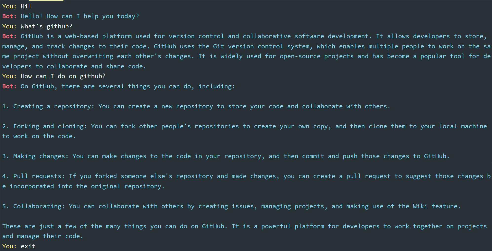

# 🎉[terminal-chat-🤖](https://github.com/raingrain/terminal-chat-bot)🎉

> *A mini chat-bot running on the terminal, using the ChatGpt model **(gpt-3.5-turbo)**.*

## Example

## Usage

1. **Download this repository.**
2. **Make sure your computer have `node.js` and `pnpm` .**
3. **Run `pnpm i` .**
4. **Get your own key from [GPT_API_free](https://github.com/chatanywhere/GPT_API_free).**
5. **Write the key to `OPENAI_API_KEY` in the `.env` file.**
6. **Run `pnpm build` to package the project in `dist/bundler.js` .**
7. **Run `pnpm dev` to use your chat-bot.**
